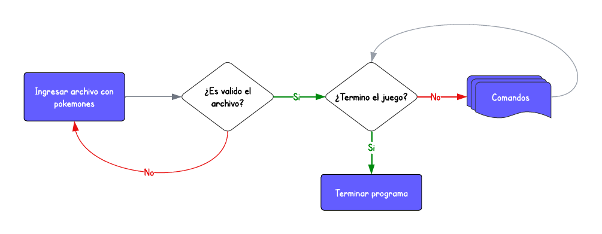
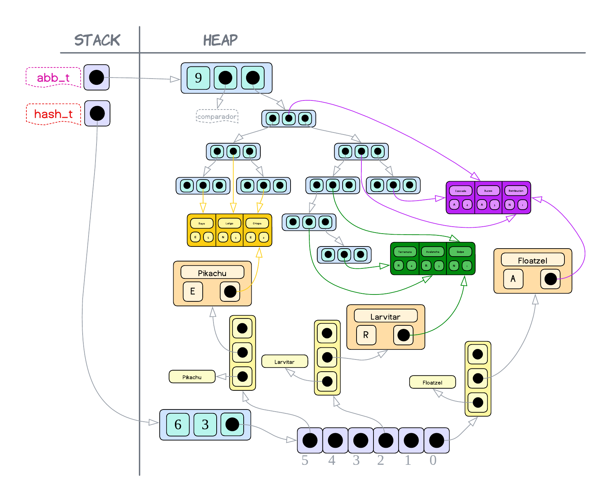
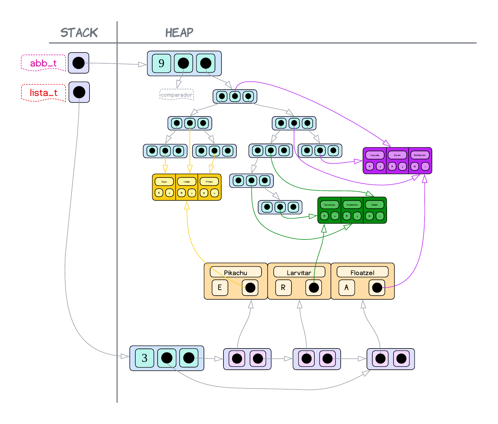
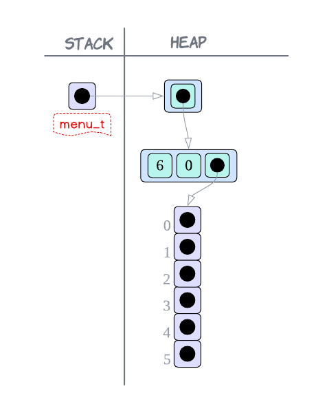
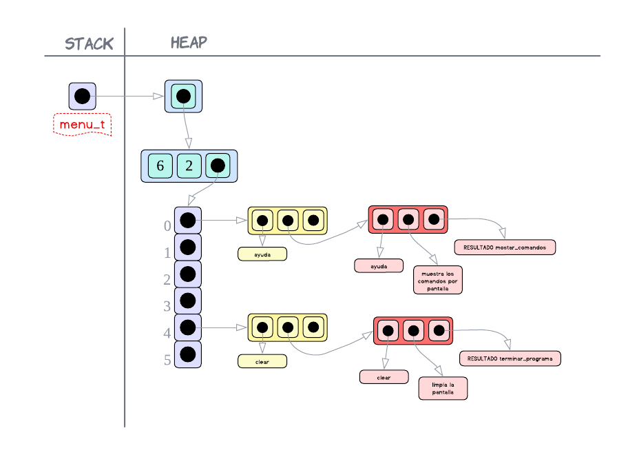

<div align="right">

</div>

# TP2

## Repositorio de Francisco Infanti - 110822 - finfanti@fi.uba.ar

- Para compilar:

```bash
make main
```

- Para ejecutar:

```bash
./main
```

- Para ejecutar con valgrind:
```bash
make
```
---
##  Funcionamiento
El programa consiste en un juego de pokemones. Para poder crear este juego se implementaron tres **TDAs** y se utilizaron otros secundarios para facilitar la implementación de los demás.

El juego se basa en un menú de comandos, donde uno comienza a jugar y utiliza los comandos disponibles para realizar diferentes acciones.

Para comenzar a jugar el usuario debe seleccionar tres pokemones, los dos primeros son para él y el tercero para una `ia`, la cual también deberá elegir tres pokemones con la misma lógica.

Una vez seleccionado los pokemones se deberán hacer jugadas e intentar conseguir la mayor cantidad de puntos. Una jugada consiste en seleccionar un pokemon y un ataque de este, una vez seleccionados se deberá luchar contra la elección de la `ia`. Dependiendo de la efectividad del ataque contra el pokémon del adversario se calculará un nuevo poder el cual al finalizar la jugada, será sumando como un puntaje.

El juego se repite hasta que no haya más ataques para batallar y gana el jugador que más puntos haya acumulado.

---
<div align="center">

</div>
<div align="center">Diagrama de flujo del programa</div>

---
Ahora voy a explicar las estructuras utilizadas para implementar el juego.

### Juego.h
Este **TDA** provee las funciones las cuales permiten llevar a cabo el juego.

Para poder implementar la lógica del juego se definieron dos estructuras y se utilizaron diferentes **TDAs** que iré mencionado.
- `struct juego` es la estructura principal, en esta se almacena la ronda en la que se encuentran los jugadores, la información de un archivo de pokemones y la información de los dos jugadores, que se encuentra almacenada en la otra estructura creada.
- `struct jugador`, en esta se almacena el puntaje, los pokemones y los ataques que tiene disponible durante el juego.

Para poder usar este **TDA** primero es necesario crearlo, luego para eso se proporciona la función `juego_crear`. Esta función, como lo dice su nombre, se encarga de reservar toda la memoria necesaria para poder llevar a cabo el juego. La complejidad computacional que tiene esta operación es constante, pues solamente se está reservando bloques de memoria en el heap y guardando la dirección de memoria de estos. Por lo tanto $T(n) = O(1)$.

También, en el caso de que no queramos usar más el juego, debemos liberar toda la memoria que fue reservada y para eso es que se proporciona la función `juego_destruir`, la cual libera toda la memoria que fue reservada previamente. En este caso la complejidad computacional es lineal, pues de haber reservado $n$ bloques de memoria, debemos liberarlos todos. Entonces $T(n) = O(n)$.

Como sabemos, el usuario para poder empezar a usar el juego necesita proporcionar un archivo con pokemones y tres ataques escritos según un formato específico. Por lo tanto es por eso que hago uso del **TDA** `pokemon.h`, este proporciona la función `pokemon_cargar_archivo`, la cual lee el archivo y guarda en estructuras en memoria la información leida. La complejidad que tiene esta función es cuadrática, pues se deben leer y guardar $n$ pokemones y luego se los ordena usando `Bubble Sort` que tiene complejidad cuadrática. Entonces:

$$T(n) = O(n²) + O(n)$$

Y como para **Big-O** el término cuadrático pesa más, $T(n) = O(n²)$.

Ahora, el problema que ocurre es que este **TDA** no tiene funciones cómodas para poder acceder a la información. Entonces por eso uso una `lista`, la cual me permite solucionar este problema. Para pasar toda la información a una `lista`, debo recorrer los $n$ pokemones e insertarlos al final de la `lista`. Luego la complejidad de esto sería lineal, pues recorrer $n$ pokemones es lineal e insertarlos al final de la lista es constante. Entonces $T(n) = O(n)$.

Toda esta lógica mencionada se lleva a cabo en la función `juego_cargar_pokemon`, la cual hace exactamente lo que explique. Si analizamos la complejidad total de esta función podemos ver que:

$$T(n) = O(n²) + O(n)$$

Y como **Big-O** toma el peor caso, $T(n) = O(n²)$.

---
<div align="center">

</div>
<div align="center">Representación de cómo se vería en memoria luego de haber guardado la información</div>

---
El juego va a necesitar un registro de las cosas que le ingresa el usuario, pues de alguna manera necesito validar las entradas que este hace. Entonces es por eso que se define la estructura `struct jugador`, en esta, como mencioné antes, voy a guardar los pokemones y ataques que tiene disponible.

Ahora, para poder guardar los pokemones que tiene el jugador, que en este caso serían siempre tres, voy a utilizar un `hash`. ¿Por que uso un `hash`?, bueno, yo voy a necesitar el pokemon solamente para poder validar las jugadas que hace el usuario, entonces yo con saber que el pokemon $x$ que me ingresó el usuario está en su `hash` entonces está todo ok. Y como el acceso a un `hash` es casi instantáneo, dicha operación de verificar si tiene ese pokémon tiene una complejidad constante, que es la menor posible. Además, como en este juego se permite tener por lo menos un pokémon repetido, no voy a necesitar memoria extra para almacenar dicho pokémon.

En cuanto a los ataques, como en este juego el ataque solamente puede ser utilizado una sola vez, lo que hago es insertarlos en un `abb`. ¿Por qué?, pues de esta manera yo voy a saber si el ataque fue utilizado o no. Si el ataque se encuentra en el `abb`, entonces es porque no fue utilizado y si no se encuentra es porque ya fue usado. Ahora, no uso un `hash`, porque en este caso si hay pokemones repetidos, entonces hay ataques repetidos. Y un `hash` no permite claves repetidas, entonces se insertaría una sola vez el ataque y solo podría ser utilizado una sola vez. Y ¿Por qué no una `lista`?, porque la complejidad de búsqueda en un `abb` en el peor caso es igual que la `lista`, pero en el mejor caso, es mejor que la `lista`.

---
<div align="center">

</div>
<div align="center">Representación de cómo podría verse insertado el jugador con todos sus ataques y pokemones cargados</div>

---
Para poder seleccionar los pokemones se proporciona la función `juego_seleccionar_pokemon`. En esta se va a validar que la entrada hecha por el usuario sea válida y en caso de serla se guardaran los pokemones/ataques en su respectiva estructura. Primero se debe verificar que los pokemones que haya ingresado el usuario no sean repetidos entre sí y después se los buscará en la `lista` que contiene todos los pokemones. En caso de que no falle ninguna de estas dos barreras, se procederá insertando los primeros dos pokemones en el `hash`  del jugador *(voy a usar el nombre del pokemon como la clave)* y los seis ataques en su `abb`. Y por último el tercer pokémon con sus ataques en el `hash` y `abb` del adversario. Veamos que la complejidad de esta operación es lineal, pues:
- Primero se debe validar la entrada hecha por el usuario. Comparar los nombres entre sí lo considero con complejidad constante, pues desprecio la complejidad de `strcmp()`. Y para determinar si los pokemones existen, los debo buscar en una `lista` y como sabemos la complejidad es lineal. Entonces nos quedaría que $T(n) = O(1) + O(n)$.
- Lo segundo sería insertar en la correspondiente estructura los pokemones y los ataques. Como en este juego solamente se permiten tres pokemones, entonces tengo que guardar en el `hash`, como máximo, tres pokemones y en el `abb`, también como máximo, nueve ataques. Entonces como esto es una cantidad constante, entonces la complejidad de insertar tanto en un `hash` y un `abb` es constante. Luego $T(n) = O(1) + O(1)$.

Por lo tanto, nos termina quedando que:

$$T(n) = O(1) + O(n) + O(1) + O(1)$$

Y esto para **Big-O** es $T(n) = O(n)$.

Cuando se quiera hacer una jugada se debe utilizar la función `juego_jugar_turno`. En esta se reciben las jugadas de los dos jugadores, se validan, se registrar el ataque utilizado, se determinará la efectividad del ataque y por último el puntaje que recibe cada jugador.

- Para validar la jugada, se debe verificar que tanto el pokémon como el ataque estén disponibles para el jugador. Luego lo que se hace es verificar si ese pokémon está en el `hash` correspondiente del jugador y si el ataque está en el `abb`. Veamos que la complejidad que tendría validar la jugada es consante, pues buscar un elemento en el `hash` o `abb` con una cantidad constante de elementos tiene complejidad constante, entonces $T(n) = O(1)$.

- Para registrar el ataque tan solo se debe eliminar del `abb` el ataque que fue usado, luego la complejidad que tiene esto tambien es consante.

- Para determinar la efectividad del ataque se me ocurrió crear un array con todos los tipos. Están acomodados de tal manera que el tipo en la posición $x$ es efectivo contra el tipo en $x+1$ e inefectivo contra el que está $x-1$. Entonces lo primero que hago es buscar las posiciones de los tipos en el array. Y plantear la cuenta `pos_tipo_ataque` - `pos_tipo_pokemon`, si:

  - Es igual a $-1$, entonces el ataque es efectivo, pues eso significa que `pos_tipo_pokemon` $>$ `pos_tipo_ataque`, es decir, el tipo del ataque está en $x$ y el del pokémon en $x+1$, pues difieren en uno.

  - Es igual a $1$, entonces el ataque es inefectivo, pues es la inversa de lo que pasó antes. En este caso `pos_tipo_pokemon` $<$ `pos_tipo_ataque`, y como difieren en uno, significa que el tipo del ataque está en $x$ y el del pokémon en $x-1$.

  - Para cualquier otro valor el ataque es regular.

 La complejidad que tiene determinar la efectividad es constante, primero porque determinar la posición en el array es constante, ya que siempre tiene la misma cantidad de elementos. Y luego hacer la cuenta `pos_tipo_ataque` - `pos_tipo_pokemon`, es hacer una operación simple.

- Por ultimo, para determinar el puntaje lo que se hace es verificar si el ataque fue efectivo, regular o infectivo y dependiendo de esto multiplicamos, dividimos o no hacemos nada con el poder del ataque. Pero para cualquier caso la complejidad también es constante.

Por lo tanto, veamos que la complejidad total de la función `juego_jugar_turno` es la siguiente:

$$T(n) = O(1) + O(1) + O(1) + O(1) + O(1)$$

Y esto para **Big-O** es $T(n) = O(1)$.

Se proporcionan también una serie de funciones las cuales permiten conocer si el juego está terminado y la cantidad de puntos de cada jugador. En ambos casos la complejidad es constante, pues en la estructura se guardan tanto los puntos de los jugadores como la ronda actual y se puede acceder a estos con una operacion simple.

### Adversario.h
Este **TDA** consiste en la lógica de un jugador, es decir, el objetivo que tiene es ser un jugador automático del juego que pueda seleccionar pokemones y hacer jugadas, osea seria una `ia`.

Para poder implementar el adversario se utiliza una estructura única, `struct adversario`. Esta estructura va a necesitar guardar los pokemones que puede seleccionar el adversario, luego me guardo un puntero a la `lista` que fue creada en juego. Esta será solo para verla, es decir no puedo modificarla.

El adversario también va a necesitar un registro de sus tres pokémones, por eso creó una `lista`, la cual guardará los tres pokemones. Utilizó una `lista`, porque este **TDA** proporciona la función `lista_elemento_en_posicion`, la cual a partir de una posición me devuelve el elemento. Entonces lo que puedo hacer es generar números aleatorios *(que cumplan ser posiciones válidas de la lista)* y de esta manera elijo pokemones al azar.

Por último, también voy a utilizar una lógica similar a la del juego con respecto a los ataques. Es decir, me voy a guardar en un `abb` los ataques que tiene disponible y a medida que los use los eliminó de este.

Cuando se quiere crear un adversario, se utiliza la función `adversario_crear`. Lo que se hace es reservar un bloque de memoria en el heap para que pueda almacenar todo lo mencionado anteriormente. Notemos que la complejidad de crear un adversario es constante $O(1)$, pues solamente estamos reservando bloques de memoria y guardandonos su dirección de memoria.

Si creamos un adversario entonces tenemos que destruirlo una vez terminemos de utilizarlo, por lo tanto es por eso que se proporciona la función `adversario_destruir`, la cual libera la memoria que estaba siendo utilizada. La complejidad de esta operación es lineal $O(n)$, pues como siempre, si reservamos $n$ bloques de memoria, debemos liberar cada uno de ellos.

La función `adversario_seleccionar_pokemon` se utiliza para hacer que el adversario elija pokemones. Para poder conseguir que el adversario elija tres pokemones distintos y únicos, lo que hago es crear un array de tres posiciones *(pues son tres pokemones)* y llenarlo con posiciones aleatorias pero unicas entre sí. La complejidad que tiene esto es constante, pues para verificar que no se repiten solamente debo comparar entre las tres posiciones.

Una vez tengo dichas posiciones, debo buscar los pokemones en la `lista` que puede llegar a tener $n$ pokemones, luego la complejidad de esto es lineal. Una vez se tiene los tres pokemones seleccionados, se insertan los dos primeros en la `lista` del adversario con sus respectivos ataques en el `abb`. La complejidad que tiene esta última operación es constante, pues voy a insertar una cantidad de pokemones/ataques fijas todas las veces que se use la función.

Por lo tanto, la complejidad total de la función `adversario_seleccionar_pokemon` es:

$$T(n) = O(1) + O(n) + O(1)$$

Y como **Big-O** toma el peor caso posible, $T(n) = O(n)$.

Como el adversario selecciona tres pokemones y solo dos van para él, me estaría faltando el tercer pokémon del adversario. Pero para eso está la función `adversario_pokemon_seleccionado`, la cual me pasa las elecciones del usuario para que el adversario lo tenga en cuenta a la hora de hacer sus elecciones. Implementó esta función solo para recibir el tercer pokémon del adversario y guardarlo en la `lista` que contiene los pokemones del adversario y guardar los ataques en el `abb`. Basándonos en la misma lógica que antes, la complejidad de esta operación es constante $O(1)$.

---
<div align="center">

</div>
<div align="center">Representación de cómo se vería en memoria el adversario con la información cargada</div>

---
Para poder hacer que el adversario haga una jugada está la función `adversario_proxima_jugada`. Primero debo generar una posición aleatoria y selecciono el pokémon que está en dicha posición. De este me guardo en un array sus tres ataques, usando la función `con_cada_ataque`. Nuevamente generó una posición aleatoria y selecciono el ataque que esté en esa posición. Veamos que esto tiene una complejidad constante, pues es cierto que tenemos que recorrer una `lista` y después los ataques del pokémon, pero la `lista` siempre tiene tamaño tres o menos y los ataques son siempre tres, así que lo podemos considerar como constante $O(1)$.

Para verificar que el ataque en la posición generada esté en el `abb`, entonces planteó un loop, mientras no esté en el `abb` y no haya iterado una cantidad de veces igual a la de los ataques, generó una nueva posición aleatoria.
- La **1ra** condición se usa para verificar que el ataque en la posición generada esté en el `abb`.
- La **2da** condición se usa para alivianar la carga de la función. Si en tres oportunidades no se generó una posición donde hay un ataque sin usar, entonces vuelvo a ejecutar la función y con suerte se selecciona otro pokemon que tarde menos en elegir otro ataque. Además esto soluciona algunos problemas que se pueden llegar a generar si el adversario tiene pokemones repetidos.

Veamos que en el peor caso de todos, debemos iterar tres veces, entonces debemos buscar tres veces un elemento en un `abb`. Ahora, como este `abb` siempre tiene como máximo nueve elementos y a medida que progresa el juego pierde elementos, entonces la complejidad de búsqueda puede ser considerada como $O(1)$. Entonces estaríamos haciendo tres operaciones constantes que es lo mismo que hacer solo una. Luego validar que el ataque tiene complejidad constante $O(1)$.

Una vez tenemos validados el pokemon y su ataque, se procede eliminando el ataque del `abb`. Veamos que la complejidad de esta operacion es $O(1)$, pues estamos eliminando un elemento de un `abb` que tiene una cantidad que a medida que transcurre el juego disminuye.

Por lo tanto la complejidad total que tiene la función `adversario_proxima_jugada` es:

$$T(n) = O(1) + O(1) + O(1)$$

Y para **Big-O** esto es igual a $T(n) = O(1)$.

### Menu.h
Este **TDA** fue implementado con el propósito de facilitar el `main`. El objetivo de este es que guarde un comando, la descripción de este y la función que ejecuta.

Entonces, para poder implementarlo se definió una estructura, `struct menu`, la cual almacena un puntero a un `hash` donde se guardaran todo lo especificado anteriormente. Decido utilizar un `hash`, porque necesito que el acceso a los comandos sea instantáneo y como sabemos, buscar un elemento en un `hash` es casi instantáneo. Ahora, para poder almacenar el comando, la descripción de este y la función que ejecuta, necesito guardarlo en una estructura. Entonces es por eso que creo la estructura privada `struct info_comando`, la cual almacenará todo esto.

Para usar el menú va a ser necesario crearlo, por eso es que se proporciona la función `menú_crear`. En esta se reserva la memoria necesaria para almacenar lo mencionado anteriormente. Veamos que la complejidad de esta operación es constante $O(1)$, pues solamente estamos reservando bloques de memoria.

---
<div align="center">

</div>
<div align="center">Representación del menú creado en memoria</div>

---
A su vez también se proporciona una función destructora, `menú_destruir`, la cual libera toda la memoria reservada previamente. En este caso la complejidad es lineal, pues si reservamos $n$ bloques de memoria, debemos liberarlos todos. Entonces $T(n) = O(n)$.

En el caso de que se quisiera insertar un comando se utiliza la función `comando_agregar`, esta lo que hace es insertar el comando junto a su descripción y a función que ejecuta en el `hash`. Por lo tanto, como la complejidad de insertar en un `hash` es lineal y además no hay un límite de comandos posibles, es decir, puede haber $n$ comandos. Entonces la complejidad total de esta función es $T(n) = O(n)$.

---
<div align="center">

</div>
<div align="center">Representación del menú con comandos en memoria</div>

---
Para poder ejecutar un comando se debe utilizar la función `ejecutar_comando`, la cual busca el comando en el `hash` y en el caso de que exista, lo ejecuta. Veamos que lo que devuelve esta función es un tipo enumerado que tiene cuatro posibilidades: *ERROR*, *OK*, *SALIR* y *COMANDO_INVALIDO*.

Por último, la complejidad de esta función es $O(1)$, porque buscar en un `hash` con $n$ elementos es casi instantáneo.

También se proporciona una función que permite saber la descripción que tiene un comando y otra que permite saber la cantidad de comandos que hay guardados en el menú. Ambas funciones tienen complejidad constante $O(1)$, pues en el primer caso, lo que se hace es buscar el comando en el `hash`, y como sabemos la complejidad de esto es $O(1)$, y luego accedemos a la descripción de este. Y en el otro caso se puede utilizar la función `hash_cantidad`, la cual con complejidad constante nos da la cantidad de elementos del `hash`.

También se proporciona un iterador interno. El cual recorre los comandos del menú y les aplica la función pasada por parámetro hasta que se quiera dejar de recorrer, por eso la función es de tipo `bool`. En este caso la complejidad es lineal, pues en el peor caso debemos aplicarle la función a cada comando del menú.

### Comun.h
Este **TDA** se creó con el propósito de agrupar las funciones que van a utilizar el `juego.h` y el `adversario.h`. Es decir, son las funciones que se repetían en ambos **TDAs** y los agrupó en uno solo.

Analizemos las complejidades de las funciones de este **TDA**:
- `comparador_abb` y `comparar_nombres` tiene complejidad constante $O(1)$, pues estamos comparando dos nombres y desprecio la complejidad de `strcmp()`.
- `guardar_ataques` lo que hace es insertar un ataque en un `abb`, entonces como el `abb` puede tener $n$ elementos, entonces la complejidad de esta operación *(considerando el abb balanceado)* es logarítmica $O(log(n))$.