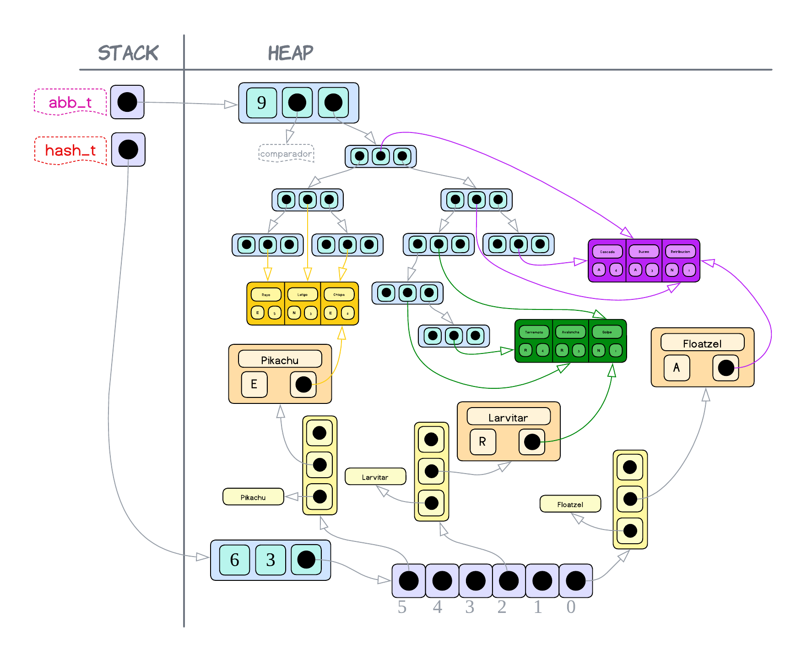

<div align="right">

</div>

# TP2

## Repositorio de Francisco Infanti - 110822 - finfanti@fi.uba.ar

- Para compilar:

```bash
make main
```

- Para ejecutar:

```bash
./main
```

- Para ejecutar con valgrind:
```bash
make
```
---
##  Funcionamiento
El programa consiste en un juego de pokemones. Para poder crear este juego se implementaron tres **TDAs** y se utilizaron otros secundarios para facilitar la implementación de los demás.

El juego se basa en un menú de comandos, donde uno comienza a jugar y utiliza los comandos disponibles para realizar diferentes acciones.

Para comenzar a jugar el usuario debe seleccionar tres pokemones, los dos primeros son para él y el tercero para una `ia`, la cual también deberá elegir tres pokemones con la misma lógica que el usuario.

Una vez seleccionado los pokemones se deberán hacer jugadas e intentar conseguir la mayor cantidad de puntos. Una jugada consiste en seleccionar un pokemon y un ataque de este, una vez seleccionados se deberá luchar contra la elección de la `ia`. Dependiendo de la efectividad del ataque contra el pokémon del adversario se calculará un nuevo poder el cual al finalizar la jugada, será sumando como un puntaje.

El juego se repite hasta que no haya más ataques para batallar. Y gana el jugador que más puntos haya acumulado.

---
<div align="center">

</div>
<div align="center">Diagrama de flujo del programa</div>

---
Ahora voy a explicar las estructuras utilizadas para implementar el juego.

*(**COMENTARIO**: Aclaró que cuando esté analizando la complejidad, en algunos casos voy a despreciar las cantidades fijas de veces que se ejecuta una operación constante, logarítmica, lineal, etc..., pues para algunos casos esta cantidad siempre va a ser fija para la implementación de este juego, como la cantidad de jugadores o la cantidad de pokémons/ataques)* `(1)`

### Juego.h
Este **TDA** provee las funciones las cuales permiten llevar a cabo el juego.

Para poder implementar la lógica del juego se definieron dos estructuras y se usaron **TDAs** auxiliares que iré mencionado.
- `struct juego` es la estructura principal, en esta se almacena la ronda en la que se encuentran los jugadores, la información de un archivo de pokemones y la información de los dos jugadores que está almacenada en la otra estructura creada.
- `struct jugador`, en esta estructura se almacena los puntos del jugador, los pokemones y ataques que tiene disponible durante el juego.

Para poder usar este **TDA** primero es necesario crearlo, luego para eso se proporciona la función `juego_crear`. Esta función, como lo dice su nombre, se encarga de reservar toda la memoria necesaria para poder llevar a cabo el juego. La complejidad computacional que tiene esta operación es constante, pues solamente se está reservando bloques de memoria en el heap y guardando la dirección de memoria de estos. Por lo tanto $T(n) = O(1)$.

También, en el caso de que no queramos usar más el **TDA**, debemos liberar toda la memoria que fue reservada y para eso es que se proporciona la función `juego_destruir`, la cual libera toda la memoria que fue reservada previamente. En este caso la complejidad computacional es lineal, pues de haber reservado $n$ bloques de memoria, debemos liberarlos todos. Entonces $T(n) = O(n)$.

Como sabemos, el usuario para poder empezar a usar el juego necesita proporcionar un archivo con pokemones y tres ataques escritos según un formato específico. Por lo tanto es por eso que hago uso del **TDA** `pokemon.h`, este proporciona la función `pokemon_cargar_archivo`, la cual lee el archivo y guarda en estructuras en memoria la información leida. La complejidad que tiene esta función es cuadrática, pues se deben leer y guardar $n$ pokemones y luego se los ordena usando `Bubble Sort` que tiene complejidad cuadrática. Entonces:

$$T(n) = O(n²) + O(n)$$

Y como para **Big-O** el término cuadrático pesa más, $T(n) = O(n²)$.

Ahora, el problema que ocurre es que este **TDA** no tiene funciones cómodas para poder acceder a la información. Entonces por eso uso una `lista`, la cual me permite solucionar este problema. Para pasar toda la información a una `lista`, debo recorrer los $n$ pokemones e insertarlos al final de la `lista`. Luego la complejidad de esto sería lineal, pues recorrer $n$ pokemones es lineal e insertarlos al final de la lista es constante. Entonces $T(n) = O(n)$.

Toda esta lógica mencionada se lleva a cabo en la función `juego_cargar_pokemon`, la cual hace exactamente lo que explique. Si analizamos la complejidad total de esta función podemos ver que:

$$T(n) = O(n²) + O(n)$$

Y como **Big-O** toma el peor caso, $T(n) = O(n²)$.

---
<div align="center">

</div>
<div align="center">Representación de cómo se vería en memoria luego de haber guardado la información</div>

---
El juego va a necesitar un registro de las cosas que le ingresa el usuario, pues de alguna manera necesito validar las entradas que este hace. Entonces es por eso que se define la estructura `struct jugador`, en esta como mencioné antes voy a guardar los pokemones y ataques que tiene disponible.

Ahora, para poder guardar los pokemones que tiene el jugador, que en este caso serían siempre tres, voy a utilizar un `hash`. ¿Por que uso un `hash`?, bueno, yo voy a necesitar el pokemon solamente para poder validar las jugadas que hace el usuario, entonces yo con saber que el pokemon $x$ que me ingresó el usuario está en su `hash` entonces está todo ok. Y como el acceso a un `hash` es casi instantáneo, dicha operación de verificar si tiene ese pokémon tiene una complejidad constante, que es la menor posible. Además, como en este juego se permite tener por lo menos un pokémon repetido, no voy a necesitar memoria extra para almacenar dicho pokémon.

En cuanto a los ataques, como en este juego el ataque solamente puede ser utilizado una sola vez, lo que hago es insertarlos en un `abb`. ¿Por qué?, pues de esta manera yo voy a saber si el ataque fue utilizado o no. Si el ataque se encuentra en el `abb`, entonces es porque no fue utilizado y si no se encuentra es porque ya fue usado. Ahora, no uso un `hash`, porque en este caso si hay pokemones repetidos, entonces hay ataques repetidos. Y un `hash` no permite claves repetidas, entonces se insertaría una sola vez el ataque y solo podría ser utilizado una sola vez. Y ¿Por qué no una `lista`?, porque la complejidad de búsqueda en un `abb` en el peor caso es igual que la `lista`, pero en el mejor caso, es mejor que la `lista`.

---
<div align="center">

</div>
<div align="center">Representación de cómo podría verse insertado el jugador con todos sus ataques y pokemones cargados</div>

---
Para poder seleccionar los pokemones se proporciona la función `juego_seleccionar_pokemon`. En esta se va a validar que la entrada hecha por el usuario sea válida y en caso de serla se guardaran los pokemones/ataques en su respectiva estructura. Primero se debe verificar que los pokemones que haya ingresado el usuario no sean repetidos entre sí y después se los buscará en la `lista` que contiene todos los pokemones. En caso de que no falle ninguna de estas dos barreras, se procederá insertando los primeros dos pokemones en el `hash` *(voy a usar el nombre del pokemon como la clave)* del jugador y los seis ataques en su `abb`, y el tercer pokémon con sus ataques en el `hash` y `abb` del adversario. Veamos que la complejidad de esta operación es lineal, pues:
- Primero se debe validar la entrada hecha por el usuario. Comparar los nombres entre sí lo considero con complejidad constante, pues desprecio la complejidad de `strcmp()`. Y para determinar si los pokemones existen, los debo buscar en una `lista` y como sabemos la complejidad es lineal. Entonces nos quedaría que $T(n) = O(1) + O(n)$.
- Lo segundo sería insertar en la correspondiente estructura los pokemones y los ataques. Sabemos que la complejidad de insertar en un `hash` es lineal y la de un `abb`, considerándolo balanceado, es logarítmica. Luego $T(n) = O(n) + O(log(n))$.

Por lo tanto, nos termina quedando que:

$$T(n) = O(1) + O(n) + O(n) + O(log(n))$$

Y esto para **Big-O** es $T(n) = O(n)$.

Cuando se quiera hacer una jugada se debe utilizar la función `juego_jugar_turno`. Se recibirán las jugadas de los dos jugadores, se validan, se elimina registrar el ataque utilizado, se determinará la efectividad del ataque y por último el puntaje que recibe cada jugador.

- Para validar la jugada, se debe verificar que tanto el pokémon como el ataque estén disponibles para el jugador. Luego lo que se hace es verificar si ese pokémon está en el `hash` correspondiente del jugador y si el ataque está en el `abb`. Veamos que la complejidad que tendría validar la jugada es logarítmica, pues buscar un elemento en el `hash` tiene complejidad constante y en un `abb` (si está balanceado) logarítmica. Y como **Big-O** toma el peor caso, entonces $T(n) = O(log(n))$.

- Para registrar el ataque tan solo se debe eliminar del `abb` el ataque que fue usado, luego la complejidad que tiene esto (si el `abb` está balanceado) es logarítmica.

- Para determinar la efectividad del ataque se me ocurrió crear un array con todos los tipos. Están acomodados de tal manera que el tipo en la posición $x$ es efectivo contra el tipo en $x+1$ e inefectivo contra el que está $x-1$. Entonces lo primero que hago es buscar las posiciones de los tipos en el array. Y plantear la cuenta `pos_tipo_ataque` - `pos_tipo_pokemon`, si:

 - Es igual a $-1$, entonces el ataque es efectivo, pues eso significa que `pos_tipo_pokemon` $>$ `pos_tipo_ataque`, es decir, el tipo del ataque está en $x$ y el del pokémon en $x+1$, pues difieren en uno.

 - Es igual a $1$, entonces el ataque es inefectivo, pues es la inversa de lo que pasó antes. En este caso `pos_tipo_pokemon` $<$ `pos_tipo_ataque`, y como difieren en uno, significa que el tipo del ataque está en $x$ y el del pokémon en $x-1$.

 - Para cualquier otro valor el ataque es regular.

 La complejidad que tiene determinar la efectividad es constante, primero porque determinar la posición en el array es constante, ya que siempre tiene la misma cantidad de elementos. Y luego hacer la cuenta `pos_tipo_ataque` - `pos_tipo_pokemon`, es hacer una operación simple.

- Para determinar el puntaje lo que se hace es verificar si el ataque fue efectivo, regular o infectivo y dependiendo de esto multiplicamos, dividimos o no hacemos nada con el poder del ataque. Pero para cualquier caso la complejidad también es constante.

Por lo tanto, veamos que la complejidad total de la función `juego_jugar_turno` es la siguiente:

$$T(n) = O(1) + O(log(n)) + O(log(n)) + O(1) + O(1)$$

Y esto para **Big-O** es $T(n) = O(log(n))$.

Se proporcionan también una serie de funciones las cuales permiten conocer si el juego está terminado y la cantidad de puntos de cada jugador. En ambos casos la complejidad es constante, pues en la estructura se guardan tanto los puntos de los jugadores como la ronda actual.

### Adversario.h
Este **TDA** consiste en la logica de un jugador del juego. Es decir, el objetivo que tiene este **TDA** es ser un jugador automatico del juego, una `ia`.

Para poder implementar el adversario se utiliza una estructura unica, `struct adversario`, la cual va almacenar un puntero a la `lista` donde estan almacenados todos los pokemones de los que va a poder elejir el adversario, a su vez tambien otro puntero a una `lista` la cual tendra los tres pokemones pertenecientes al adversario y por ultimo un `abb`, que va a ser utilizado para determinar si el ataque fue usado o no.

---
<div align="center">

</div>
<div align="center">Representacion de como se veria en memoria la estructura del adversario con informacion cargada</div>

---
Uso una `lista` en los dos primeros casos, porque como el adversario va a elegir siempre pokemones al azar *(sino es muy aburrido el juego)* entonces la `lista` me proporciona una funcion, `lista_elemento_en_posicion`, la cual a partir de una posicion de la `lista` me devuelve lo que hay en esta. Entonces yo puedo generar posiciones al azar con cierto rango y obtener pokemones validos al azar. Algo que es muy util a la hora de seleccionar los primeros tres pokemones y el pokemon para hacer la jugada. Ahora, elijo un `abb` con el proposito de registrar los ataques no usados, por el mismo motivo que lo utilice en juego. 

Cuando se quiear crear un adversario, se utiliza la funcion `adversario_crear`. Esta lo que se hace es reservar un bloque de memoria en el heap para que pueda almacenar todo lo mencionado anteriormente. Al igual que en el juego, cuando se este usando un **TDA** para almacenar cierta infomacion, se utiliza su respectiva funcion creadora. Notemos que la complejidad de crear un adversario es constante $O(1)$, pues solamente estamos reservando bloques de memoria y guardandonos su direccion de memoria.

Si creamos un adversario entonces tenemos que destruirlo una vez terminemos de utilizarlo, por lo tanto es por eso que se proporciona la funcion `adversario_destruir`, la cual libera la memoria que estaba siendo utilizada. Tambien como en el caso de la creacion, en el caso de los **TDAs** se utiliza su respectiva funcion destructora. La complejidad de esta operacion es lineal $O(n)$, pues si reservamos $n$ bloques de memoria, debemos liberar cada uno de ellos.

Lo mas importante que va a realizar el adversario, es seleccionar los tres pokemones y luego seleccionar un pokemon con un ataque para hacer una jugada. En esta implementacion la `ia` es perfecta, es decir, nunca se equivoca, luego cada pokemon que seleccione y cada jugada que haga va a ser siempre valida. Entonces para la funcion `adversario_seleccionar_pokemon` y `adversario_proxima_jugada`, este siempre devuelve algo valido, mientras que no se haya ingresado algo erroneo.

Para poder hacer que el adversario seleccione tres pokemones, se debe utilizar la funcion `adversario_seleccionar_pokemon`. Lo que se hizo para que el adversario eliga tres pokemones de la lista sin repetir ninguno, fue crear un array de posiciones. En cada posicion se utiliza `rand() % rango`, lo cual nos da un numero aleatorio entre el rango que le demos. Logicamente, el rango en esta caso es la cantidad de elementos que tiene la `lista`. Una vez que tenemos las tres posiciones unicas, buscamos los pokemones en la `lista` y se inserta los primeros dos en otra `lista` donde se registran los pokemones propios. A su vez, se obtienen los ataques de esos pokemones y se los guarda en un `abb`.

---
<div align="center">

</div>
<div align="center">Representacion de como se veria en memoria la seleccion de un pokemon</div>

---
Analizemos la complejidad de esta funcion. Veamos que lo primero que hacemos es crear el array con las posiciones, ahora para verificar que sean unicas, vamos a tener que recorrer el array varias veces. Pero como en este juego solamente se permiten tres pokemones, entonces el tamaño del array es tres. Por lo tanto la complejidad que tiene recorrer un array de tres elementos, tiende mas a ser $O(1)$ que $O(n)$.

Lo siguiente que tenemos que hacer es buscar en una `lista` tres pokemones, sabemos que buscar un elemento en una `lista` tiene complejidad lineal, aunque lo estemos haciendo tres veces, pues hacerlo una y tres es casi lo mismo. Pero ademas de buscarlos, tambien debemos insertarlos al final de una `lista`, lo cual tiene complejidad es constante. Entonces buscar los pokemones e insertar los que corresponden en la `lista` tiene complejidad $O(n)$. Tambien al mismo tiempo que estamos insertando los pokemones *(del adversario)*, debemos insertar sus tres ataques *(que lo podemos considerar como insertar uno solo)* en el `abb`, y sabemos que la complejidad de esto *(si el `abb` se mantiene balanceado)* es $O(log(n))$. Luego:

$$ T(n) = O(1) + O(n) + O(log(n))$$

Y como el termino lineal pesa mas que el logaritmico, la complejidad termina siendo $O(n)$.

Como el adversario selecciona tres pokemones y solo dos van para el, me estaria faltando el tercer pokemon del adversario. Pero para eso esta la funcion `adversario_pokemon_seleccionado`, la cual me pasa las elecciones del usuario para que el adversario lo tenga en cuenta a la hora de hacer sus elecciones. Yo implemento esta funcion solo para recibir el tercer pokemon del adversario y guardarlo en la `lista` que contiene los pokemones del adversario y guardar los ataques delen el `abb`. Veamos que la complejidad de la insercion en la `lista` es constante y la insercion en el `abb` logaritmica *(suponiendo que esta balanceado)*. Luego la complejidad total es: 

$$T(n)= O(1) + O(log(n))$$

Y esto para **Big-O** es $O(log(n))$.

Para poder hacer que el adversario haga una jugada, esta la funcion `adversario_proxima_jugada`. Primero debo generar una posicion aleatoria que puede ir desde cero hasta tres *(que seria el tamaño de la lista de sus pokemones)*. Una vez obtenida dicha posicion obtenemos el pokemon que se encuentra en esta, de dicho pokemon me cargo en un array sus tres ataques, usando la funcion `con_cada_ataque`. Nuevamente genero una posicion aleatoria entre cero y tres y selecciono el ataque que toque. Veamos que esto tiene una complejidad constante, es cierto que tenemos que recorrer una `lista` y despues los ataques del pokemon, pero la `lista` siempre tiene tamaño tres o menos y los ataques son siempre tres, asi que lo podemos considerar como constante y por eso digo que es $O(1)$.

Ahora debo verificar que el ataque en la posicion generada este en el `abb`, entonces planteo un loop, mientras no este en el `abb` y no haya iterado una cantidad de veces igual a la de los ataques, genero una nueva posicion aleatoria. La primera condicion se usa para verificar que el ataque en la posicion generada este en el `abb` y la segunda condicion se usa para alivianar la carga de la funcion. Si en tres oportunidades no se genero una posicion donde hay un ataque sin usar, entonces vuelvo a ejecutar la funcion y con suerte se selecciona otro pokemon que tarde menos en elegir otro ataque. Veamos que en el peor caso de todos, debemos iterar tres veces, entonces debemos buscar tres veces un elemento en un `abb`. Si el `abb` esta balanceado, el tiempo de busqueda es logaritmico, luego $T(n) = 3.O(log(n))$. Ahora como tres es un numero constante, podemos considerar $T(n) = O(log(n))$. Luego validar que el ataque sea valido tiene complejidad logaritmica $O(log(n))$. 

Una vez tenemos validados el pokemon y su ataque, se procede eliminando el ataque del `abb`. Y antes de salir de la funcion se verifica que el pokemon seleccionado siga teniendo ataques disponibles para ser usados. Entonces lo que hago es recorrer el `abb` y verificar si estan, por lo menos uno, de los ataques del pokemon. Si no hay ninguno, entonces elimino ese pokemon de la `lista`. Pues no tiene sentido manterlo, ya que no voy a poder usarlo para nada. Notemos que en este caso, al estar eliminando un elemento de un `abb` balanceado, estamos haciendo una operacion $O(log(n))$ y ademas estamos haciendo algo similar, si es que no es igual, que lo que haciamos antes para verificar el ataque y para ese caso habia dicho que la complejidad era logaritmica. Luego $T(n) = O(log(n)) + O(log(n))$, y esto par **Big-O** es $T(n) = O(log(n))$. 

Por lo tanto la complejidad total que tiene la funcion `adversario_proxima_jugada` es:

$$T(n) = O(1) + O(log(n)) + O(log(n))$$

Y para **Big-O** esto es igual a $T(n) = O(log(n))$.

### Menu.h