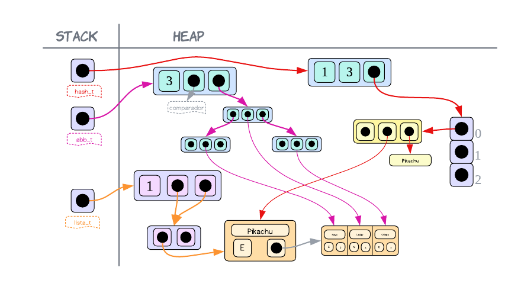

<div align="right">

</div>

# TP2

## Repositorio de Francisco Infanti - 110822 - finfanti@fi.uba.ar

- Para compilar:

```bash
make main
```

- Para ejecutar:

```bash
./main
```

- Para ejecutar con valgrind:
```bash
make
```
---
##  Funcionamiento
El programa consiste en un juego de pokemones. Para poder crear este juego se implementaron dos **TDAs** principales y se utilizaron otros secundarios para facilitar la implementacion de los dos **TDAs** principales.

La juego se basa en un menu de comandos, donde uno comienza a jugar y escribiendo `'ayuda'` se le muestran todos los comandos que este tiene disponible. 

Para comenzar a jugar, el usuario debe seleccionar tres pokemones, los dos primeros son para el y el tercero para una `ia`, la cual tambien eligira tres pokemones.

Una vez seleccionado los pokemones, se deberarn ir haciendo jugadas. Una jugada consiste en seleccionar un pokemon y un ataque de este y luchar contra la eleccion de la `ia`. Dependiendo de la efectividad del ataque contra el pokemon del adversario, se calculara un nuevo poder, el cual al finalizar la jugada, sera sumando como un puntaje.

El juego se repite hasta que no haya mas ataques para batallar. Y gana el jugador con mas puntos.

---
<div align="center">

</div>
<div align="center">Diagrama de flujo del programa</div>

---
Ahora voy a pasar a explicar como funcionan los **TDAs** que hacen posible que el juego funcione.

### Juego.h
Este **TDA** provee funciones las cuales permiten poder llevar a cabo el juego. 

Para poder implementar la logica del juego, se definieron dos estructuras y se usaron diferentes **TDAs** que ire mencionado. 
- `struct juego` es la estructura principal. En esta se almacena la ronda en la que se encuentran los jugadores, la informacion de un archivo de pokemones y la informacion de los dos jugadores que esta almacenada en la siguiente estructura creada.
- `struct jugador`, esta estructura almacena los puntos del jugador, los pokemones que este tiene y los ataques que tiene disponible.

Antes de pasar a explicar como se implemento el juego y por que se usaron ciertos **TDAs**, voy a mencionar por encima explicando su complejidad las funciones triviales de este **TDA**.
- `juego_crear` crea el juego, es decir, reserva toda la memoria que sea necesaria para poder llevar a cabo el juego. En los casos donde se usaron otros **TDAs** para guardar informacion, se utilizo su respectiva funcion creadora. Veamos que la complejidad de esto es constante $O(1)$, pues solamente estamos reservando bloques de tamaño adecuado y guardando sus direcciones de memoria.
- `juego_destruir` libera toda la memoria que fue reservada para poder usar el juego. En los casos donde se utilizo otro **TDA** se uso sus respectivas funciones destructoras. Veamos que la complejidad de esta funcion siempre es $O(n)$, pues si reservamos y utilizamos $n$ bloques de memoria, vamos a tener que liberar los $n$ bloques.
- Las funciones relacionadas a saber cierto dato acerca del juego, como: `juego_listar_pokemon`, `juego_obtener_puntaje` y `juego_finalizado`. Tienen complejidad constante $O(1)$, pues para devolver un resultado a estas funciones, lo que se hace es acceder a un campo de la estructura a la cual tenemos acceso directo.

Como sabemos, el usuario para poder empezar el juego necesita proporcionar un archivo con pokemones y tres ataques, todo esto esta escrito segun un formato. Por lo tanto es por eso que hago uso del **TDA** `pokemon.h`, este proporciona una funcion la cual lee de un archivo segun un formato y de lo que lee lo guarda en una estructura en memoria. Una vez termina de leer devuelve un puntero a esa estructura, `informacion_pokemon_t`, que contiene toda la informacion de los pokemones. La complejidad que tiene leer el archivo y guardarlo en memoria es $O(n²)$, pues se deben leer $n$ pokemones y luego se los ordena usando `Bubble Sort` que tiene complejidad cuadratica. Entonces termina siendo una suma de algo que tiene complejidad lineal y algo que tiene cuadratica, y para **Big-O** el termino cuadratico pesa mas.

El problema es que este **TDA** no tiene funciones comodas para poder acceder los datos de todos los pokemones. Entonces por este problema es que hago uso del **TDA** `lista.h`. Lo que hice fue insertar cada pokemon, con su respectiva informacion, en una `lista` y de esta manera tengo un acceso mas comodo a los datos de los pokemones. La complejidad que tiene insertar los $n$ pokemones al final de la `lista` es $O(n)$, pues debemos recorrer los $n$ pokemones e insertarlos al final de la lista lo cual tiene una complejidad constante. 

Toda esta logica se lleva acabo en la funcion `juego_cargar_pokemon`. Si analizamos la complejidad total de esta operacion podemos ver que: 

$$T(n) = O(n²) + O(n)$$ 

Y como **Big-O** toma el peor caso, entonces $T(n) = O(n²)$.

---
<div align="center">

</div>
<div align="center">Representacion de como se veria en memoria luego de haber cargado la informacion</div>

---
Para poder guardar los pokemones seleccionados por el `jugador1` y el `jugador2` hago uso de un `hash` usando el nombre del pokemon como clave, pues a mi lo unico que me interesa es saber que pokemones tienen ambos jugadores para de esta manera poder validar sus jugadas. Y como el acceso a un elemento de un `hash` es casi instantaneo la complejidad seria la menor posible. Tambien otro dato seria que en el caso de que hubiese pokemones repetidos, no tengo que insertarlos dos veces, entonces consumo menos memoria. 

Pero bueno, al momento de seleccionar los pokemones, se recibe el nombre de tres pokemones. Dos para el jugador que los ingreso y el tercero para su adversario. Entonces lo que se hace es insertar los pokemones en el `hash` correspondiente. Veamos que la complejidad de esto es $O(n)$, pues insertar elementos en un `hash` tiene complejidad lineal.

A su vez, ademas de guardarme los pokemones en un `hash`, tambien me guardo todos los ataques de este en un `abb`. Esto lo hago porque cuando se ingrese un pokemon junto a su ataque (para hacer una jugada), voy a necesitar saber si ese ataque fue usado o no. Entonces si el ataque esta en el `abb` es porque no fue usado y puede ser usado. Ahora si no lo esta, es porque ya fue utilizado y debe elegir otro. Entonces en el caso de que hubiera un pokemon repetido, si hubiera usado un `hash` no se habrian insertado los tres ataques *(si usaba el nombre del ataque como clave)*, entonces seria mas dificil determinar si ya fue usado o no. Pero al estar usando un `abb`, no tenemos ese problema. Ademas entre un `abb` y una `lista`, si el `abb` se mantiene balanceado, entonces tiene una mejor complejidad.

Entonces hay que agregar que a la hora se seleccionar los pokemones, debo insertar los ataques en el correspondiente `abb`. Por lo tanto la complejidad de esto, suponiendo que el arbol continua balanceado a medida que se insertan, seria $O(log(n))$.

Esta logica de seleccionar pokemones se lleva a cabo en la funcion `juego_seleccionar_pokemon`. Si analizamos la complejidad total de esta operacion tengo que añadir que antes de insertar en el `hash` y el `abb`, se valida que los nombres de los pokemones no se repitan entre si. Para lograr esto comparo los tres nombres entre si, lo cual tiene complejidad constante. Y ademas debo verificar que los tres pokemones esten en la `lista`, entonces se recorre tres veces la `lista`, lo cual tiene complejidad lineal. 

Por lo tanto luego de todo esto podemos concluir que 

$$T(n) = O(1) + O(n) + O(n) + O(log(n))$$ 

Y esto para **Big-O** es $O(n)$.

---
<div align="center">

</div>
<div align="center">Representacion de como se veria insertado un pokemon con sus ataques en el hash y el abb. No estan dibujados los punteros NULL</div>

---
Al momento de hacer una jugada se hace uso de la funcion `juego_jugar_turno`. En esta se recibira tanto la jugada del `jugador1` como la del `jugador2`, ambas deben ser validadas. Y ¿como se valida?, lo que se debe hacer es verificar que el pokemon seleccionado exista en el `hash` del jugador, para eso uso la funcion `hash_obtener`, la cual devuelve el elemento que coincida con la clave pasada o `NULL` si no existe. En el caso de que exista, entonces obtenemos el ataque usando `pokemon_buscar_ataque` y por ultimo, usando `abb_buscar` se procede a buscar el ataque seleccionado en el `abb`. Como mencionea antes, si el ataque esta, entonces puedo usarlo.

Veamos que la complejidad para determinar si una jugada es valida es $O(log(n))$. Pues lo que debemos hacer es primero verificar si el pokemon realmente lo tiene el jugador, entonces lo buscamos en el `hash` y esto tiene una complejidad constante $O(1)$. En caso de que exista, pasamos a buscar el ataque del pokemon y como solo hay tres posbiles casos, podemos decir que la complejidad es $O(3) = O(1)$. Y por ultimo lo buscamos en el `abb`, y si suponemos que esta balanceado, la complejidad es $O(log(n))$. Entonces:

$$T(n) = O(1) + O(log(n)) + O(1)$$

Y para **Big-O** esto es $T(n) = O(log(n))$

Ya habiendo validado la jugada, tenemos luz verde para pasar a determinar la efectividad del ataque, el poder/puntaje y eliminar el ataque usado del `abb`.

Para determinar la efectividad, se me ocurrio crear un array con todos los tipos. Estan acomodados de tal manera que el tipo en la posicion $x$ es efectivo contra el tipo en $x+1$ e infectivo contra $x-1$. Entonces lo primero que hago es buscar las posiciones de los tipos en el array. Y plantear la cuenta `pos_tipo_ataque` - `pos_tipo_pokemon`, si:
- Es igual a $-1$, entonces el ataque es efectivo, pues eso significa que `pos_tipo_pokemon` $>$ `pos_tipo_ataque`, es decir, el tipo del ataque esta en $x$ y el del pokemon en $x+1$, pues difieren en uno.
- Es igual a $1$, entonces el ataque es inefectivo, pues es la inversa de lo que paso antes. En este caso `pos_tipo_pokemon` $<$ `pos_tipo_ataque`, y como difieren en uno, significa que el tipo del ataque esta en $x$ y el del pokemon en $x-1$.
- Para cualquier otro valor el ataque es regular.

La complejidad que tiene determinar la efectividad es constante $O(1)$, pues determinar la posicion en el array es constane, pues siempre tiene la misma cantidad de elementos. Y luego hacer la cuenta `pos_tipo_ataque` - `pos_tipo_pokemon`, tambien tiene complejidad constante.

Para determinar el puntaje lo que se hace es verificar si el ataque fue efectivo, regular o infectivo y dependiendo de esto multiplicamos, dividimos o no hacemos nada con el poder del ataque. Pero para cualquier caso la complejidad es $O(1)$.

Y por ultimo debemos quitar el ataque utilizado del `abb` usando la funcion `abb_quitar`. Suponiendo que este esta balanceado, la complejidad de esto seria $O(log(n))$

Por lo tanto, veamos que la complejidad total de la funcion `juego_jugar_turno` es la siguiente: 

$$T(n) = O(1) + O(log(n)) + O(1) + O(1) + O(log(n))$$

Y esto para **Big-O** es $O(log(n))$.

---

### Adversario.h
Este **TDA** consiste en la logica de un jugador del juego. Es decir, el objetivo que tiene este **TDA** es ser un jugador automatico del juego, una `ia`.

Para poder implementar el adversario se utiliza una estructura unica, `struct adversario`, la cual va almacenar un puntero a la `lista` donde estan almacenados todos los pokemones de los que va a poder elejir el adversario, a su vez tambien otro puntero a una `lista` la cual tendra los tres pokemones pertenecientes al adversario y por ultimo un `abb`, que va a ser utilizado para determinar si el ataque fue usado o no.

---
<div align="center">

</div>
<div align="center">Representacion de como se veria en memoria la estructura del adversario con informacion cargada</div>

---
Uso una `lista` en los dos primeros casos, porque como el adversario va a elegir siempre pokemones al azar *(sino es muy aburrido el juego)* entonces la `lista` me proporciona una funcion, `lista_elemento_en_posicion`, la cual a partir de una posicion de la `lista` me devuelve lo que hay en esta. Entonces yo puedo generar posiciones al azar con cierto rango y obtener pokemones validos al azar. Algo que es muy util a la hora de seleccionar los primeros tres pokemones y el pokemon para hacer la jugada. Ahora, elijo un `abb` con el proposito de registrar los ataques no usados, por el mismo motivo que lo utilice en juego. 

Cuando se quiear crear un adversario, se utiliza la funcion `adversario_crear`. Esta lo que se hace es reservar un bloque de memoria en el heap para que pueda almacenar todo lo mencionado anteriormente. Al igual que en el juego, cuando se este usando un **TDA** para almacenar cierta infomacion, se utiliza su respectiva funcion creadora. Notemos que la complejidad de crear un adversario es constante $O(1)$, pues solamente estamos reservando bloques de memoria y guardandonos su direccion de memoria.

Si creamos un adversario entonces tenemos que destruirlo una vez terminemos de utilizarlo, por lo tanto es por eso que se proporciona la funcion `adversario_destruir`, la cual libera la memoria que estaba siendo utilizada. Tambien como en el caso de la creacion, en el caso de los **TDAs** se utiliza su respectiva funcion destructora. La complejidad de esta operacion es lineal $O(n)$, pues si reservamos $n$ bloques de memoria, debemos liberar cada uno de ellos.

Lo mas importante que va a realizar el adversario, es seleccionar los tres pokemones y luego seleccionar un pokemon con un ataque para hacer una jugada. En esta implementacion la `ia` es perfecta, es decir, nunca se equivoca, luego cada pokemon que seleccione y cada jugada que haga va a ser siempre valida. Entonces para la funcion `adversario_seleccionar_pokemon` y `adversario_proxima_jugada`, este siempre devuelve algo valido, mientras que no se haya ingresado algo erroneo.

Para poder hacer que el adversario seleccione tres pokemones, se debe utilizar la funcion `adversario_seleccionar_pokemon`. Lo que se hizo para que el adversario eliga tres pokemones de la lista sin repetir ninguno, fue crear un array de posiciones. En cada posicion se utiliza `rand() % rango`, lo cual nos da un numero aleatorio entre el rango que le demos. Logicamente, el rango en esta caso es la cantidad de elementos que tiene la `lista`. Una vez que tenemos las tres posiciones unicas, buscamos los pokemones en la `lista` y se inserta los primeros dos en otra `lista` donde se registran los pokemones propios. A su vez, se obtienen los ataques de esos pokemones y se los guarda en un `abb`.

---
<div align="center">

</div>
<div align="center">Representacion de como se veria en memoria la seleccion de un pokemon</div>

---
Analizemos la complejidad de esta funcion. Veamos que lo primero que hacemos es crear el array con las posiciones, ahora para verificar que sean unicas, vamos a tener que recorrer el array varias veces. Pero como en este juego solamente se permiten tres pokemones, entonces el tamaño del array es tres. Por lo tanto la complejidad que tiene recorrer un array de tres elementos, tiende mas a ser $O(1)$ que $O(n)$.

Lo siguiente que tenemos que hacer es buscar en una `lista` tres pokemones, sabemos que buscar un elemento en una `lista` tiene complejidad lineal, aunque lo estemos haciendo tres veces, pues hacerlo una y tres es casi lo mismo. Pero ademas de buscarlos, tambien debemos insertarlos al final de una `lista`, lo cual tiene complejidad es constante. Entonces buscar los pokemones e insertar los que corresponden en la `lista` tiene complejidad $O(n)$. Tambien al mismo tiempo que estamos insertando los pokemones *(del adversario)*, debemos insertar sus tres ataques *(que lo podemos considerar como insertar uno solo)* en el `abb`, y sabemos que la complejidad de esto *(si el `abb` se mantiene balanceado)* es $O(log(n))$. Luego:

$$ T(n) = O(1) + O(n) + O(log(n))$$

Y como el termino lineal pesa mas que el logaritmico, la complejidad termina siendo $O(n)$.

Como el adversario selecciona tres pokemones y solo dos van para el, me estaria faltando el tercer pokemon del adversario. Pero para eso esta la funcion `adversario_pokemon_seleccionado`, la cual me pasa las elecciones del usuario para que el adversario lo tenga en cuenta a la hora de hacer sus elecciones. Yo implemento esta funcion solo para recibir el tercer pokemon del adversario y guardarlo en la `lista` que contiene los pokemones del adversario y guardar los ataques delen el `abb`. Veamos que la complejidad de la insercion en la `lista` es constante y la insercion en el `abb` logaritmica *(suponiendo que esta balanceado)*. Luego la complejidad total es: 

$$T(n)= O(1) + O(log(n))$$

Y esto para **Big-O** es $O(log(n))$.

Para poder hacer que el adversario haga una jugada, esta la funcion `adversario_proxima_jugada`. Primero debo generar una posicion aleatoria que puede ir desde cero hasta tres *(que seria el tamaño de la lista de sus pokemones)*. Una vez obtenida dicha posicion obtenemos el pokemon que se encuentra en esta, de dicho pokemon me cargo en un array sus tres ataques, usando la funcion `con_cada_ataque`. Nuevamente genero una posicion aleatoria entre cero y tres y selecciono el ataque que toque. Veamos que esto tiene una complejidad constante, es cierto que tenemos que recorrer una `lista` y despues los ataques del pokemon, pero la `lista` siempre tiene tamaño tres o menos y los ataques son siempre tres, asi que lo podemos considerar como constante y por eso digo que es $O(1)$.

Ahora debo verificar que el ataque en la posicion generada este en el `abb`, entonces planteo un loop, mientras no este en el `abb` y no haya iterado una cantidad de veces igual a la de los ataques, genero una nueva posicion aleatoria. La primera condicion se usa para verificar que el ataque en la posicion generada este en el `abb` y la segunda condicion se usa para alivianar la carga de la funcion. Si en tres oportunidades no se genero una posicion donde hay un ataque sin usar, entonces vuelvo a ejecutar la funcion y con suerte se selecciona otro pokemon que tarde menos en elegir otro ataque.

Una vez tenemos validados el pokemon y su ataque, se procede eliminando el ataque del `abb`. Y antes de salir de la funcion se verifica que el pokemon seleccionado siga teniendo ataques disponibles para ser usados. Entonces lo que hago es recorrer el `abb` y verificar si estan, por lo menos uno, de los ataques del pokemon. Si no hay ninguno, entonces elimino ese pokemon de la `lista`. Pues no tiene sentido manterlo, ya que no voy a poder usarlo para nada.

Veamos que la complejidad que tiene seleccionar 

### Menu.h